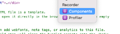
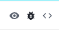
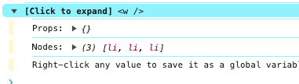
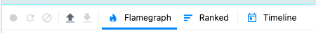

### 📅 2024년 3월 27일

# 📚 6장 리액트 개발 도구로 디버깅하기
> - 리액트로 개발된 애플리케이션의 디버깅을 돕기 위한 리액트 개발도구 react-dev-tools 알아보기
## 6.3 리액트 개발도구 활용하기

### 6.3.1 컴포넌트 (Components)
- 현재 리액트 애플리케이션의 컴포넌트 트리를 확인할 수 있다.
- props와 hooks등 다양한 정보를 확인할 수 있다.

#### 함수의 이름
- 함수 선언식 혹은 표현식으로 선언되지 않는 컴포넌트는 개발 도구에서 컴포넌트를 특정하기 어렵다.
- 컴포넌트를 기명 함수로 선언한다면 개발 도구에서 확인하는데 많은 도움을 준다.
- 만약, 함수에 이름을 설정하기 어렵다면, `displayName` 속성을 사용하자.

 
- 눈 아이콘 : 해당 요소의 HTML 확인 가능
- 벌레아이콘 : 콘솔창에 해당 컴포넌트 정보가 기록됨
  - 
- 소스코드 아이콘: 컴포넌트의 소스코드

### 6.3.2 프로파일러
- 리액트가 렌더링하는 과정에서 발생하는 상황을 확인하기 위한 도구
- 렌더링 과정에 기입해 디버깅에 필요한 내용을 기록해야 하기 때문에, 프로덕션 빌드로 실행하는 리액트 애플리케이션에서는 사용할 수 없다.

#### 옵션
- `General` 탭 Highlight updates when ... : 렌더링될 때 마다 해당 컴포넌트에 하이라이드 표시
- `Debugging` 탭 hide logs during second ... : 리액트 엄격모드 시 useEffect 등 두번씩 작동하는 것 제거
- `Profiler` 탭 Redord why each component ... : 프로파일링 중 뭐때문에 렌더링 됐는지 기록

#### 프로파일링

- 첫번째 버튼: 프로파일링 시작
- 두번째 버튼 : 새로고침 후 프로파일링 시작
- 세번째 버튼: 프로파일링 종료
- 네번째 버튼: 프로파일 불러오기
- 다섯번째 버튼: 프로파일 저장하기
  - JSON 파일로 저장됨

- **Flamegraph**
  - 렌더 커밋별로 어떠한 작업이 일어났는지 알 수 있다.
  - 너비가 넓을수록 해당 컴포넌트를 렌더링하는데 오래걸렸다는 것을 의미
  - 노란색에 가까울 수록 렌더링에 오래걸린 컴포넌트
  - 녹색에 가까울 수록 빠르게 렌더링된 컴포넌트
  - 렌더링되지 않으면, 회색으로 표시

- **Ranked**
  - 해당 커밋에서 렌더링하는 데 오래걸린 컴포넌트를 순서대로 나열한 그래프
  - 단순히 렌더링이 발생한 컴포넌트만 보여줌

- **타임라인**
  - 시간이 지남에 따라 컴포넌트에서 어떤 일이 일어나는지
  - React 18환경 이상에서만 확인 가능

# 📚 7장 크롬 개발자 도구를 활용한 애플리케이션 분석
- 브라우저 개발자 도구 : 일반적인 브라우저 환경에서 발생할 수 있는 문제를 디버깅할 수 있는 도구

## 7.2 요소탭
- 웹페이지를 구성하는 HTML, CSS 등의 정보를 확인할 수 있음

## 7.3 소스탭
- 소스 중단점을 생성해 자바스크립트 실행을 중단시키고 디버깅을 수행할 수 있다.

## 7.4 네트워크 탭
- 페이지를 불러오는 기간 동안 발생한 총 요청 건수와 총 다운로드한 업로드 리소스 크기를 확인할 수 있음.
- 리소스 크기가 크다면, gzip, brotli 을 사용하자

> [Gzip 압축으로 사이트 최적화하는 방법](https://velog.io/@ss-won/FE-%EB%B2%88%EC%97%AD-Gzip-%EC%95%95%EC%B6%95%EC%9C%BC%EB%A1%9C-%EC%82%AC%EC%9D%B4%ED%8A%B8-%EC%B5%9C%EC%A0%81%ED%99%94%ED%95%98%EB%8A%94-%EB%B0%A9%EB%B2%95)
> - **요약: **
> 큰 데이터를 압축해서 보여주면, 브라우저가 알아서 압축을 해제해 사용자에게 보여준다.

 
## 7.5 메모리탭
- 힙 스냅샷: 현재 시점의 메모리 상황을 알고 싶을 때
- 타임라인의 할당 계측: 시간의 흐름에 따라 메모리의 변화를 살펴보고 싶을 때
- 할당 샘플링: 메모리 공간을 차지하고 있는 자바스크립트 함수를 볼 수 있음.

- 얕은 크기: 객체 자체가 보유하는 메모리 바이트
- 유지된 크기: 객체 자체뿐만 아니라 다른 부모가 존재하지 않는 모든 자식 객체들의 크기까지 더한 값
- 메모리누수를 찾을 땐, 얕은 크기는 작으나 유지된 크기가 큰 객체를 찾아야 한다.

[개발자도구를 이용해 성능측정을 해본 경험(진짜 사소함)](solzy_개발자도구.md)
