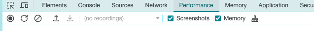
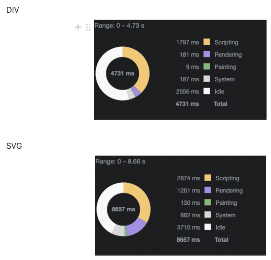
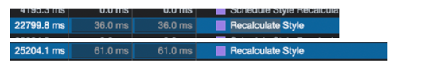
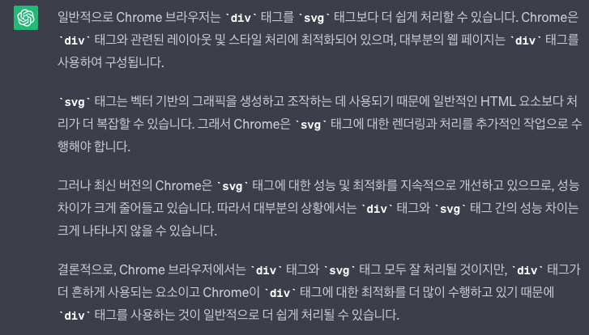
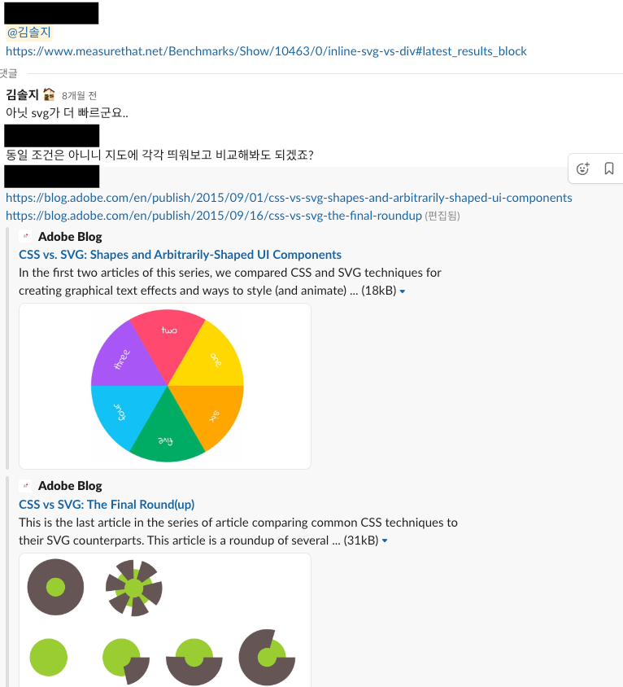

# 퍼포먼스 탭을 사용해 테스트해본 경험 공유
> *author. solzy*

## 문제상황


- 네이버 지도에 **수만개의 마커**를 그려야 함
- 수만 개의 dom을 그려내는건 **성능부하의 원인이 될 수 있음.**
- 조금이라도 부하를 덜어보기 위해, 화면에 뿌려지는 마커를 가볍게 그리고 싶었음. 🚀
- 화면의 그리는 마커
  -  1️⃣ div element 에 css style을 줘서 그린 마커
  -  2️⃣ svg tag 마커
- 둘 중에 어떤 방법이 렌더링 비용이 더 적을까 ?

## 테스트 시작!
- div element 로 이루어진 마커 N개
- svg tag 로 이루어진 마커 N개
- 같은 환경에서 naver map 위에 올려 테스트

```typescript jsx
const SvgMarker = () => (
  <svg width={2 * 6} height={2 * 6} viewBox={`0 0 ${2 * 6} ${2 * 6}`} overflow="visible">
    <circle pointerEvents="visiblepainted" cx={6} cy={6} r={6} strokeWidth="1px" fill="red" stroke="white" />
  </svg>
)
```

```typescript jsx
const DivMarker = styled.div`
  background-color: red;
  width: 13px;
  height: 13px;
  border-radius: 100%;
  border: 1px solid white;
`
```

## 결과
> 개발자도구의 퍼포먼스 탭을 이용했습니다.

> React Profiler와 동일하게 녹화해서 사용할 수 있음 ! 
>
> https://codingmoondoll.tistory.com/entry/%ED%81%AC%EB%A1%AC-%EA%B0%9C%EB%B0%9C%EC%9E%90-%EB%8F%84%EA%B5%AC%EC%9D%98-Performance-%ED%83%AD-%EB%8B%A4%EB%A3%A8%EA%B8%B0-%EA%B8%B0%EB%B3%B8%ED%8E%B8



- scriping 단계(코드 읽는 단계) 에서 소요되는 시간은 엇비슷
- rendering 때 걸리는 비용이 SVG 가 더 든다.


#### 어느 지점에서 오래걸리나? 

- `Recalculate Style` 과정에 두 배 정도 차이남 (cssdom, render tree 만드는 과정)
- 왜? 모를땐 Chat GPT ...
  - 
  **- 결론: 크롬 브라우저는 div태그와 관련된 스타일 처리에 최적화되어있다.**


## 결론
- 개발자도구 탭을 이용해 요런 경험을 했다 ^^;

## 여담
- **실제로 개발 해보지 않는 이상 모른다 !**
- 
  - div vs svg 를 비교한 아티클에서는 svg가 더 우세하다고 나와있었다. 🥹
  - 하지만, 실제로 해보니 div가 더 우세했고..ㅎ
  - 개발하는 환경은 상황에 따라 다르니, 너무 아티클을 맹신하지 말고 , 아리까리할 땐 직접 테스트해보는 것을 추천
  - 우리에겐 개발자도구라는 완벽한 도구가 있으니까 😎
